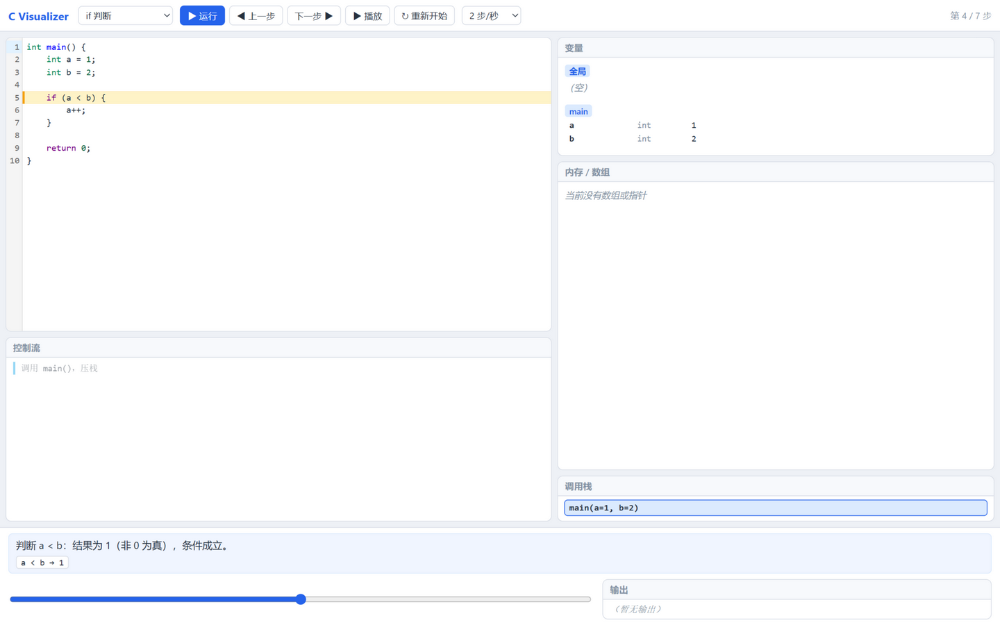
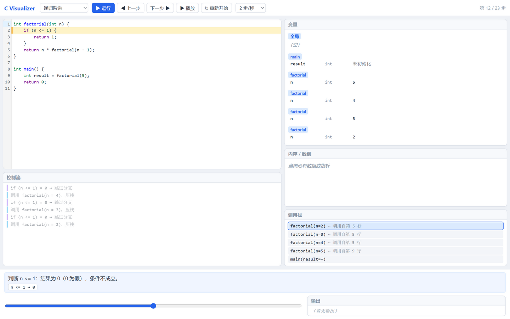
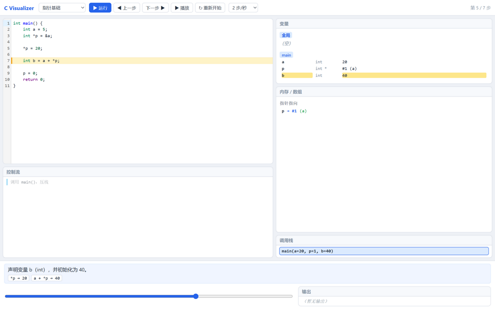
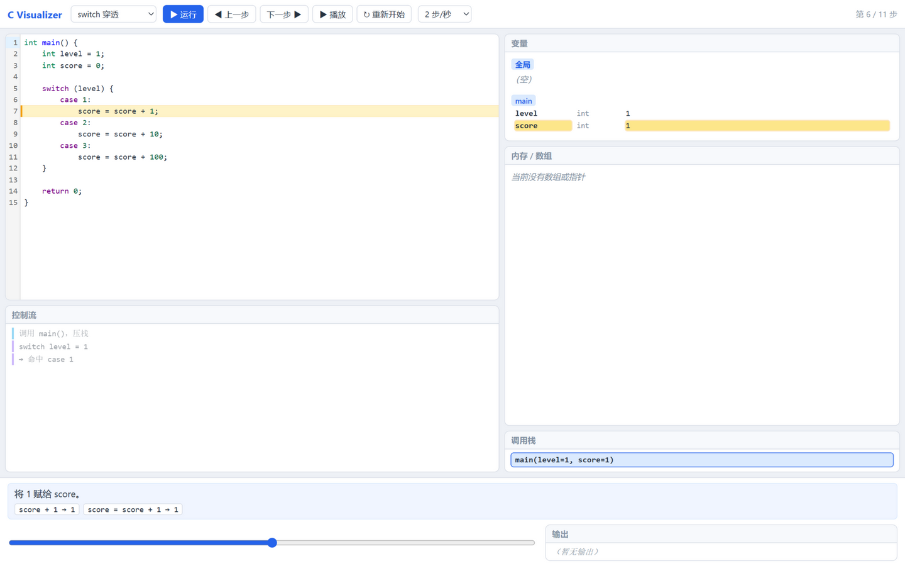

# C Visualizer

面向 C 语言初学者的**代码执行可视化教学工具**。在浏览器中输入 C 代码，逐语句执行，
直观观察变量、表达式、条件、循环、数组、指针、函数调用栈、switch、goto 等状态如何一步一步变化。

无需安装任何编译器或插件——解析（tree-sitter-c wasm）与执行（自研教学解释器）全部在浏览器本地完成。

## 在线 Demo

**[https://yangxijia111.github.io/C-Visualizer/](https://yangxijia111.github.io/C-Visualizer/)**

> 在线版本由 GitHub Pages 自动部署（push 到 main 即发布）。首次启用需在仓库
> Settings → Pages → Build and deployment 中将 Source 设置为 **GitHub Actions**。

## 功能截图

| 总览 | 递归与调用栈 |
| --- | --- |
|  |  |

| 指针与内存 | 控制流轨迹 |
| --- | --- |
|  |  |

## 核心特性

- **逐步执行**：Run / Pause / Next / Previous / Restart / 时间轴任意跳转；回退基于每步完整快照，绝对精确
- **中文教学说明**：每一步自动生成简短说明（确定性规则，无 AI 依赖）
- **表达式求值轨迹**：子表达式按求值顺序展示「源码 → 值」，短路未执行的右侧明确标注「未执行」
- **可视化面板**：变量监视器（按作用域分组、变化高亮）、内存/数组格子、指针指向、调用栈、控制流轨迹、printf 输出
- **播放速度**：0.5 / 1 / 2 / 4 / 8 步/秒 五档可调
- **错误友好**：语法错误（行列定位）/ 不支持的特性（含替代建议）/ 运行时错误 / 死循环保护，全部有中文提示，绝不崩溃
- **纯浏览器运行**：无后端、无数据上传；示例库 21 个示例覆盖全部核心语法点

## 快速开始

要求 Node.js ≥ 20.19（本地开发使用 Node 24 验证）。

```bash
npm install
npm run dev        # 开发服务器（http://localhost:5173）
```

质量检查与构建：

```bash
npm test           # 全量测试（vitest）
npm run lint       # ESLint
npm run typecheck  # TypeScript strict 检查
npm run build      # 生产构建（根路径 base）
npm run build:pages # GitHub Pages 构建（/C-Visualizer/ base）
npm run preview    # 本地预览构建产物
```

## 支持的 C 子集

- **类型**：`int`（32 位环绕）、`char`、`float`/`double`、一层指针 `T *`、一维数组 `T[n]`、`void`（返回类型）
- **变量**：声明 / 初始化 / 赋值 / 复合赋值 / 多声明符 / 全局变量 / 块作用域与遮蔽 / for 作用域
- **运算符**：算术、`++ --`、比较、逻辑（`&&` `||` 短路）、赋值系列；完整 C 优先级与结合性
- **控制流**：`if / else`、`switch`（含穿透）、`while`、`for`、`do-while`、`break`、`continue`、`goto` + 标签
- **函数**：定义、按值传参、指针参数、返回值、递归（深度上限 100）
- **内置函数**：`printf`（`%d %i %f %c %s %%` + 常用转义）、`puts`

## 不支持的 C 子集（遇到即给出中文提示 + 替代建议）

`#include` 及预处理指令、`struct / union / enum / typedef`、二维及多维数组、二级指针、
指针算术（`p+1`）、动态内存（`malloc/free`）、`sizeof`、强制类型转换、位运算、三目 `?:`、
逗号运算符、函数指针、`scanf` 等输入函数、`const/static` 存储类、K&R 函数等。

权威清单见 [docs/SUPPORTED_C.md](docs/SUPPORTED_C.md)。

## 项目架构

```
源代码 → tree-sitter-c 解析（wasm）→ CST
      → 教学 AST（自研转换，保留行列位置）
      → 语义检查（类型 / 标签 / printf 格式）
      → 解释器（同步执行，三重保护：10000 步 / 100 层深度 / 10 秒墙钟）
      → ExecutionStep[]（每步完整快照 + 求值轨迹 + 控制流事件 + 中文说明）
      → React 播放器（时间轴任意跳转 O(1)，绝不重新推演）
```

## 测试

测试覆盖解析、转换、语义检查、解释器（表达式/循环/switch/goto/函数/递归/数组/指针）、
保护边界、示例库集成，以及发布回归（控制流事件分离 / 播放边界 / Pages 构建产物 / 文档一致性 / 公共导出）：

```bash
npm test
```

CI（GitHub Actions）在每次 push 与全部 PR 上运行 lint + typecheck + test + build（Node 22 / 24 矩阵）。

## 技术栈

React 19 · TypeScript（strict）· Vite · vitest · ESLint · CodeMirror 6 · web-tree-sitter + tree-sitter-c（MIT）

## 项目结构

```
├── src/
│   ├── App.tsx            # 布局 + 播放器状态机
│   ├── main.tsx           # 入口（安装浏览器 wasm 加载器）
│   ├── site-config.ts     # Pages 子路径常量
│   ├── styles.css         # 全部样式（含窄窗口断点）
│   ├── core/              # 与 UI 无关的核心：cst / convert / check / interpreter / run / steps / explain
│   ├── examples/          # 内置示例库（21 个示例）
│   └── ui/                # CodeEditor / Panels / flow-history / playback（纯逻辑可单测）
├── tests/                 # vitest 测试（含 tests/release.test.ts 发布回归）
├── docs/                  # 设计文档 + 开发阶段报告 + assets/
├── scripts/               # parser 可行性 spike
└── .github/workflows/     # ci.yml + deploy-pages.yml
```

## 文档导航

| 文档 | 内容 |
| --- | --- |
| [docs/PRODUCT.md](docs/PRODUCT.md) | 产品定位与成功标准 |
| [docs/REQUIREMENTS.md](docs/REQUIREMENTS.md) | 功能与非功能需求 |
| [docs/SUPPORTED_C.md](docs/SUPPORTED_C.md) | **支持的 C 子集权威清单** |
| [docs/PARSER_DESIGN.md](docs/PARSER_DESIGN.md) | 解析器选型（tree-sitter-c）与转换管线 |
| [docs/AST_SPEC.md](docs/AST_SPEC.md) | 教学 AST 节点定义 |
| [docs/EXECUTION_ENGINE.md](docs/EXECUTION_ENGINE.md) | 解释器/快照/步骤模型 |
| [docs/VISUALIZATION_SPEC.md](docs/VISUALIZATION_SPEC.md) | UI 布局与可视化规范 |
| [docs/ERROR_SPEC.md](docs/ERROR_SPEC.md) | 错误分类与文案规范 |
| [docs/TEST_PLAN.md](docs/TEST_PLAN.md) | 测试策略 |
| [docs/ARCHITECTURE.md](docs/ARCHITECTURE.md) | 总体架构 |
| [docs/ROADMAP.md](docs/ROADMAP.md) | 开发路线 |
| [docs/CHANGELOG.md](docs/CHANGELOG.md) | 变更日志 |
| [docs/P10_PUBLIC_RELEASE_HARDENING.md](docs/P10_PUBLIC_RELEASE_HARDENING.md) | v1.0.1 发布加固计划 |
| [docs/FINAL_REPORT.md](docs/FINAL_REPORT.md) | v1.0 最终报告 |

## 已知限制

- 教学简化与标准 C 存在**有意差异**（如未初始化读取报错、不要求先声明后使用、main 可省略 return），详见 [docs/SUPPORTED_C.md](docs/SUPPORTED_C.md) §3
- 不支持二维数组、指针算术、动态内存等进阶特性（见上文「不支持的 C 子集」）
- 首次加载需下载约 800 KB 的 tree-sitter wasm 资源（此后浏览器有缓存）
- 以桌面端浏览器为主；窄窗口下提供纵向堆叠的基础可用布局，未做移动端专门设计
- 播放速度最高 8 步/秒，超长程序建议配合时间轴跳转使用

## 贡献方式

欢迎 Issue 与 PR：

1. Fork 仓库并从 `main` 创建分支
2. 提交前确保 `npm run lint && npm run typecheck && npm test && npm run build` 全部通过（CI 同样执行这四项）
3. 新增语言特性请同步更新 [docs/SUPPORTED_C.md](docs/SUPPORTED_C.md) 与测试
4. 保持提交信息语义化（`feat:` / `fix:` / `docs:` / `ci:` / `test:`）

## License

[MIT](LICENSE) © 2026 yangxijia111
